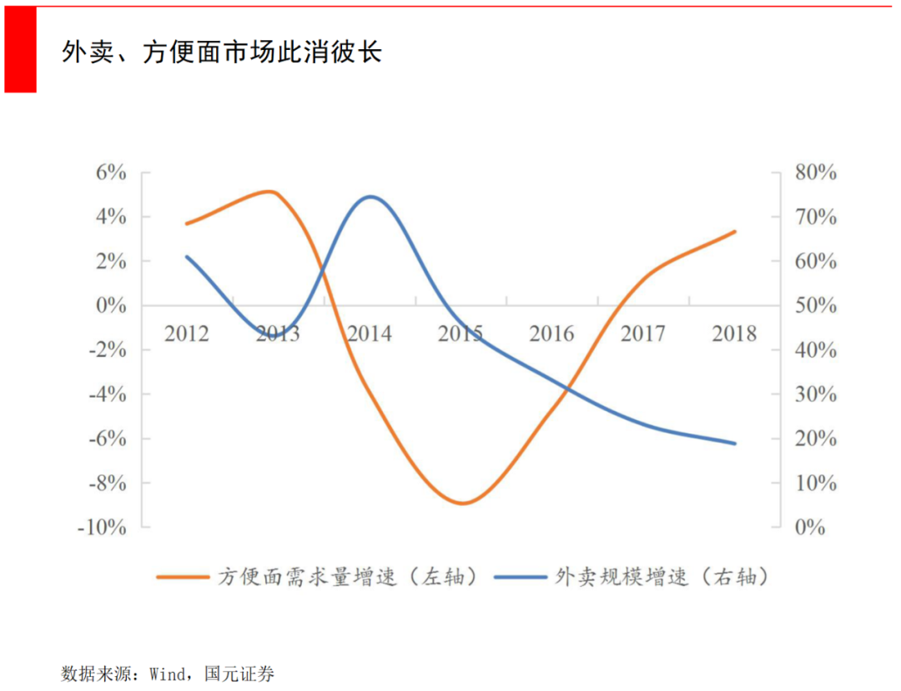
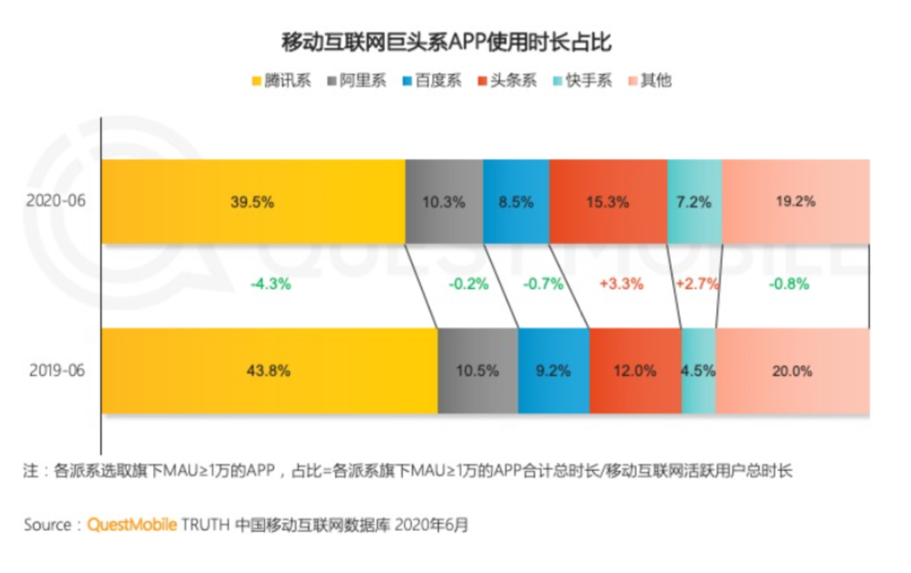

# 数字化冲击 - Think Out of Box

> 外卖平台与方便面销量

## 红酒、咖啡与视频平台

> “什么产品会对一款红酒产生最大的威胁？”
> 
> 2019年韩国首尔到釜山的企业拜访之行，Hong Se-Joon教授突然问我，他是一个“好酒之徒”。
> 
> 如果回答“另一种红酒”，或者“茅台”，实在是缺乏新意。想到红酒是在聚会中常喝的酒，而越来越多的人选择去咖啡馆聚会，我回答到：“咖啡”。
> 
> Se-Joon教授的脸上露出了笑容，“咖啡是一个不错的答案，但如果你能回答Netflix或者Youtube（国外常用的视频平台），我会给你鼓掌。”
> 
> Se-Joon教授的话让我陷入沉思：
> 
> 聚会是一种社交活动，咖啡馆虽然有社交功能，但是没有从根本上改变用户的社交行为。
> 
> 但是Netflix和Youtube等视频平台的出现，让人们沉浸在精神世界里，从而减少了对社交的需求。
> 
> 咖啡馆只是满足需求的一种方式，视频平台却可能让需求不复存在。

## 来自替代品的威胁

1979年 Michael E. Porter 首次提出了五力模型，29年后的2008年，Porter进一步解释了五力模型。

替代品的威胁（ Threat of Substitue Products or Services ）是企业受到的五力之一。

在1979年， Porter 对于替代品威胁的解释，主要考虑了替代品可以提供更好的性价比( price-performance trade-off )。

到2008年，Porter对替代品威胁进行了更充分的诠释。视频会议替代了商务旅行。市区公寓的兴起影响了对乡间别墅的需求，进而影响了对别墅草坪修剪机的需求。替代品的威胁变得没那么直接（indirect），容易被忽略（easy to overlook）。

外卖平台影响了方便面的销量。看似完全不同的产品（very different from the industry's product）,或者看似完全不相关的业务（seemingly unrelated businesses）,却可能产生巨大的替代品威胁。

更高性价比的替代品虽然仍是一个威胁，但Porter提醒我们对其他行业的变化保持警惕（be particularly alert to changes in other industries）。

## 春从春游夜专夜

> 移动互联网对用户时间的竞争

> 承欢侍宴无闲暇，春从春游夜专夜。后宫佳丽三千人，三千宠爱在一身。

随着用户移动互联网使用时长的见顶，移动互联网产品出现了零和博弈（Zero-Sum Game），或者可以看作达到了帕累托最优（Pareto Optimum，非损人不能利己）。

如果思维更发散一点：用户的时间是有限的，用户的预算也是有限的，所有抢占用户时间和预算的产品，都可以归类为有威胁的替代品。

抖音和快手在短视频领域产生了直接的竞争，互为替代。但腾讯却不能作壁上观，因为用户在抖音花费的时间越长，在腾讯系产品中花费的时间就越短。

> 根据快手招股说明书，腾讯持有快手21.567%的股份，是最大的机构股东。

## 应对数字化冲击

> 视频会议替代商务旅行，甚至影响租赁市场。
>
> 外卖平台替代方便面消费。
> 
> 短视频娱乐替代网络游戏。
> 
> 手机支付让小偷无钱可偷。

替代品的威胁时刻存在，互联网企业之间，互相竞争和替代。

替代品的威胁时刻存在，数字化会以意想不到的方式，冲击传统行业。

商业竞争，没有高枕无忧。

夕惕若厉，开放心态，应对数字化冲击。

