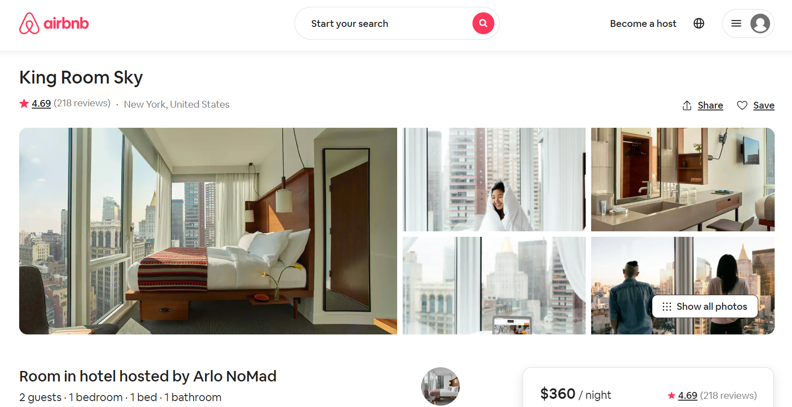

# 帮房东拍照-Airbnb创业之路的启示

> Airbnb 房间照片

Airbedandbreakfast.com（充气床垫和早饭）在2008年8月上线，2019年，Airbnb收入47亿美元。

12年时间，从创业公司，到1232亿美元（以2021年3月1日交易价格计算）市值的公司，Airbnb经历了快速的增长。

## 帮房东拍照

> 以下内容基于：2018年3月23日，CNBC的Christine Tan对Airbnb的联合创始人Joe Gebbia的专访

在Airbnb的初创期，平台上只有大约30个房东在出租自己的房间（we had about 30 hosts），房东上传到平台的照片惨不忍睹。（our hosts didn’t have great photos of their listings）

这30个房东中，可能没有摄影爱好者，他们不懂构图、光线、景深，不懂光圈、快门、ISO。2008年，手机的拍照功能也不像今天这么强大。

房东用手机拍摄自己的房间，有的房东在晚上拍摄，房间因为没有合适的光线黯然失色。（using their camera phones or taking pictures at night and it wasn’t really presenting their homes in the best possible light）

如果房东不能上传漂亮的房间照片，就不能吸引租客预定自己的房间。如果没有足够的
租客，房东会逐渐放弃Airbnb这个平台。

毕业于罗德岛设计学院（Rhode Island School of Design）的创始人Brian Chesky和Joe Gebbia租了一台相机，开始拜访房东，给他们免费拍摄。（Brian and I would rent this really nice camera, and we would go door to door throughout Manhattan and Brooklyn taking photos of host properties for free.）

## 跟用户交朋友

Brian Chesky和Joe Gebbia为用户免费拍摄，主要收获有两点：
1. 得到了漂亮的照片，提高了房间对租客的吸引力
2. 与用户交了朋友，听到了真实的反馈，更加了解用户

当用户看到两位创始人拍摄的照片时，惊呼拍的太好了，并请他们喝茶。（‘Oh my god, my apartment looks amazing. Do you want to stay for coffee or tea?’ ）

从而，两位创始人得以接近用户，了解用户，听取用户的反馈。（‘Tell me a story about a time you faced a challenge using our service?’）

> 漂亮的房间照片，根据用户反馈进行的系统改进，让Airbnb跃上新台阶，顺利通过了孵化机构 Y Combinator的 demo day, 并进一步获得了红杉资本（Sequoia Capital）60万美元投资

## 企业级数字化产品

企业级数字化产品的设计和实施，会遇到与Airbnb创业初期类似的问题：用户数据的质量不高。

低质量的数据会影响数字化产品的实施效果。不显著的实施效果，会影响组织的信心和决心，让数据质量更加难以把控。

解决这一问题的思路，也可以学习Airbnb：
1. 在数字化产品实施初期，帮助用户运营这个数字化产品，提高数据质量
2. 与用户交朋友，听取用户反馈，对产品迭代升级

## 给我一个拒绝的理由

在新加坡读MBA期间，我曾带领技术团队，为一个世界500强企业设计项目管理数字化平台。数字化平台的主要用户在印度尼西亚，技术团队在上海和雅加达。我们在上海招募了15名左右IT工程师，负责系统的核心技术开发。为了充分适应印度尼西亚用户的工作流程和用户体验，我们在雅加达团队招募了20名设计师和IT工程师，负责用户体验设计和本地化开发。

充足的开发资源、充分的本地化设计，拔剑四顾，仿佛找不到竞争对手。

但是当我们的产品交付之后，虽然经过了管理层的多次宣导，一线的用户却不是很热衷。每天临近下班，大量的低质量数据会涌入系统。我知道，这是一线员工为了“应付”领导的数字化要求，所做的“表面文章”。

为什么精心设计的数字化产品，反而成为了一线员工的“负担”？为什么一线员工还是愿意使用老旧的工作流程，却不愿意尝试行业的最佳实践？

请给我一个拒绝的理由。

## 运营数字化平台与倾听用户声音

先坐飞机，再转轮渡，我到达了一个承载了三万人的工业园。我的用户，就是这里一线的操作员工。赤道的高温在灼烧，通过翻译，我对一线的印度尼西亚员工进行了深度访谈。

我曾经认为，一线员工不喜欢使用新的平台是因为没有得到充足的培训，建议管理层增加培训的频率。看到采访对象可以熟练使用平台的各种功能，我知道操作培训已经足够了。

我意识到，技术性的操作并不是数字化平台推广的阻力，数字化平台的推广，不在培训教室，而日常工作中。

一线员工缺乏应用数字化平台的场景，他们不知道数字化平台的每一个节点如何跟工作流程结合。只能在每天下班的时候做双份的工作，把Excel里的数据复制到数字平台。

我要做的，就是和一线的管理者一起：
1. 根据新的数字化平台，调整工作流程
2. 在工作流程的特定节点，提醒员工使用数字化平台，并帮助他们收集和上传数据

一线管理者用了两个月左右的时间，让一线员工适应了数字化平台带来的新的工作流程，业务流程与数据流动融为一体。数据刻画了真实的业务场景，数据质量大幅度提高。

“使用”而不是“操作”数字化平台，让一线员工感受到了数字化带来的效率提升，他们也开始根据自己对工作流程的理解，提出了很有价值的改进建议。

## “使用”而不是“操作”

无论是Airbnb这种面向消费者的数字化平台，还是印度尼西亚的企业级数字化平台，单纯的技术交付和操作培训并不能保证平台的成功推行。

让用户“用起来”，而不只是“会操作”。把用户当作朋友，设身处地来帮助用户，帮助用户理解数字化平台，帮助用户使用数字化平台，才能发挥数字化平台的最大价值。
