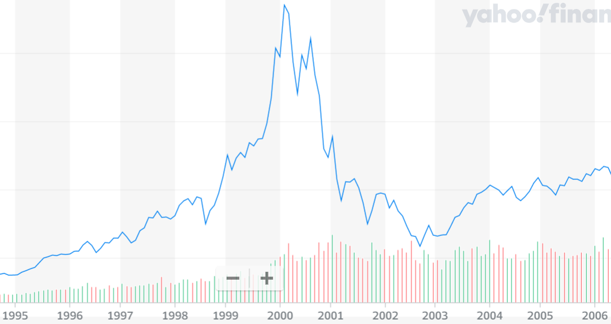
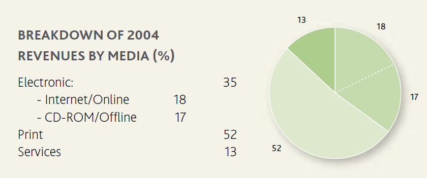
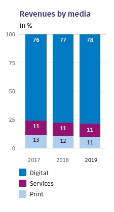
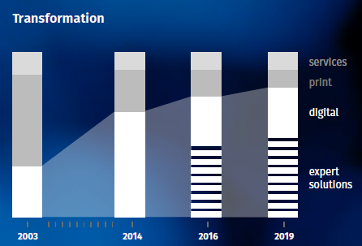

# 从出版巨头到软件公司 - Wolters Kluwer 数字化转型之旅

## 第一次互联网泡沫-站在2021年回望

26年前，1995年1月，纳斯达克综合指数（NASDAQ Composite）755点。2000年2月，纳斯达克综合指数4696点。五年时间，纳斯达克综合指数上涨522%，更直观一点，1995年1月买入1美元纳斯达克综合指数ETF，五年后获得6.22美元。

这是第一次互联网泡沫（Internet Bubble）。

第一次互联网泡沫在2000年2月达到4696顶点后，迅速破灭，到2003年9月纳斯达克综合指数只剩了1786点。

## Wolters Kluwer 数字化转型之旅

在2003年9月，荷兰出版巨头Wolters Kluwer的Nancy McKinstry升任CEO和董事会主席，开启了一段传奇的数字化转型之旅。

21世纪初，虽然资本市场对互联网的价值产生了质疑，但越来越多的传统企业在这次泡沫中认识了互联网，并开始思考如何利用互联网设计新的商业模式。

根据2004年Wolters Kluwer的年度财务报告，Wolters Kluwer 33亿欧元的收入中，出版业务占比52%，是一家以出版为主营业务的公司。而到了2019年，Wolters Kluwer的出版业务只占46亿欧元收入的11%，而数字化和服务业务占比达到了89%

2019年的Wolters Kluwer已经很难被称为出版公司，更应该被称为一家软件公司。从Wolters Kluwer的自我介绍中，也可以看到Wolters Kluwer对于自己的定位。

>Wolters Kluwer的主要产品是专业信息、软件解决方案和服务，客户是临床医生，会计师，律师以及税务，金融，审计，风险，合规和监管部门。（Wolters Kluwer is a global provider of professional information, software solutions, and services for clinicians, accountants, lawyers, and tax, finance, audit, risk, compliance, and regulatory sectors. ）

## Wolters Kluwer 数字化转型的两个阶段

转型很难，数字化转型更难。Wolters Kluwer经历了怎样的历程，在出版业被互联网严重冲击的时代，转型成一家软件公司？为什么Wolters Kluwer能够转型成功？

根据《哈佛商业评论》对Nancy McKinstry的专访，我们可以看到Wolters Kluwer数字化转型的两个阶段。

在数字化转型的第一个阶段，Wolters Kluwer并不知道数字化可以带来什么，也不知道如何做数字化转型。Wolters Kluwer只是把印刷在纸上内容，转换格式，变成在线的内容（picking up all this content and putting it available online）。

第一阶段的转型，不但没有创造新的利润，反而因为要同时制作两种格式的内容，导致了利润的缩减（The first wave, it didn't create any bigger profit pools. The profit pools shrunk. Because you had to invest in two kinds of formats.）

第二阶段的数字化转型，Wolters Kluwer开始提供专家解决方案(expert solutions)，把专业领域的知识和技术结合了起来（bring content, or domain expertise together with technology）。Wolters Kluwer开发的软件为客户创造了巨大的价值（We developed a tool and we deliver it to our customers and the tool gives them enormous value），因此得以扩充利润(enlarging the profit pools).

举例来说，在税务合规领域，Wolters Kluwer成为了最大的软件供应商。绝大多数的会计师在为客户处理退税业务时，会用到Wolters Kluwer的税务软件。

## Wolters Kluwer 数字化转型三要素

总结一下，Wolters Kluwer第一次转型，实现了内容在线化，但是并没有为客户创造很多价值，因此利润不增反降。第二次转型，通过提供专业软件，在工作效率、工作成果、洞察力等方面（productivity, or insights, or better outcomes），为客户带来了清晰可见的提升(really demonstrable results that the customer can see)，从而提升了利润。

为什么Wolters Kluwer的数字化转型如此成功？可以从：
1. 核心竞争力（Core Competency）
2. 对数字化转型的持续探索
3. 对数字化转型长期投入的耐心
 
三个角度来解释。

1. 核心竞争力

Wolters Kluwer是一家有百年历史的专业出版商，客户主要是律师、会计师、医生等专业人士。因此，Wolters Kluwer积累了大量的专业内容（domain knowledge），而这些专业内容和对专业内容的理解是纯粹的互联网公司所不具备的。同时，在与律师、会计师、医生等专业作者和读者打交道的过程中，Wolters Kluwer可以充分了解用户的工作习惯和工作流程，开发的软件更契合用户的需要。

同样的转型，我们在富士胶片身上也看到过。从胶片制造商转型为化妆品制造商和制药商，富士胶片充分利用了自己的核心竞争力。胶片、化妆品、药品看似差异巨大，但本质上都是高分子化学。而富士胶片在研发胶片的过程中，在高分子化学领域拥有深厚的技术积累，因此能够成功转型到化妆品和药品制造，避免了胶片业务萎缩导致的危机。

2. 对数字化转型的持续探索

Wolters Kluwer数字化转型的第一阶段并没有成功，但是Wolters Kluwer没有放弃转型，而是一直坚持探索，终于走出了专业软件的新天地。

第一次转型实现了内容的在线化，过程繁琐（heavy lifting），收益不高，但是为第二次转型铺平了道路。

Wolters Kluwer的CEO Nancy McKinstry 认为第一次转型为第二次转型打下了至关重要的基础（First wave was critical because we wouldn't be where we are today without it）。

3. 对数字化转型长期投入的耐心

Wolters Kluwer 2019年最畅销的产品，是在12年前，也就是2007年开始开发的。

Wolters Kluwer的工作流程管理产品，需要数年的开发，和5-7年的市场培育期。

专业软件的开发难度超过一般意义的管理软件，需要对专业知识和专业用户的工作流程有充分理解，因此开发周期长。

让专业用户改变原有的工作习惯，转用数字化产品，也需要长时间的市场推广和用户培训。

长时间的开发和推广，意味着大量的投资，企业需要长期投资的耐心（patience around investing over the long term）。
